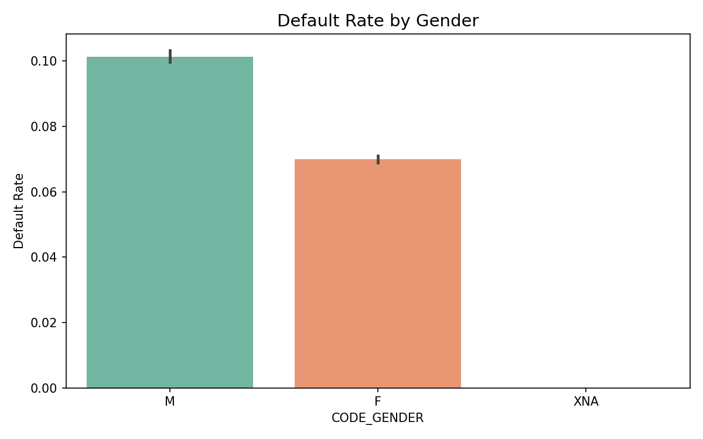
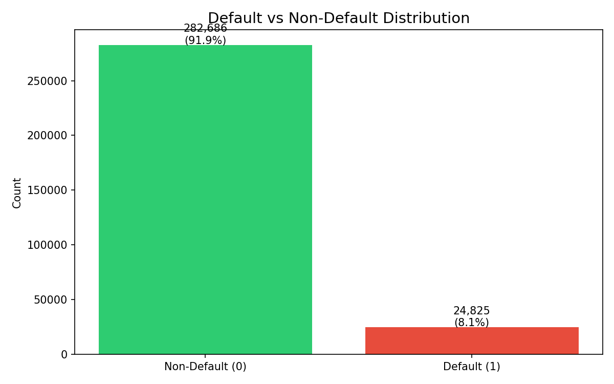
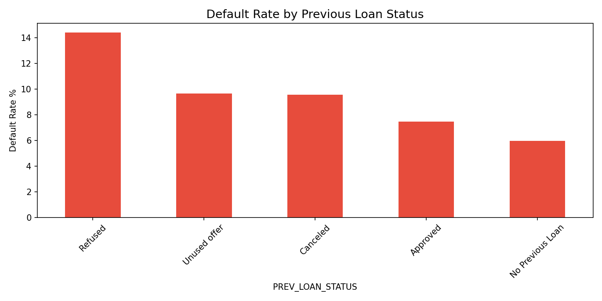
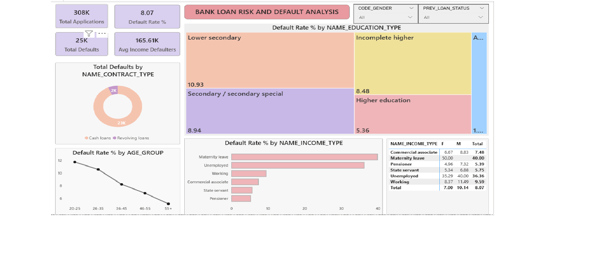

# Loan_Risk_and_Default_Analysis
---
# 📖 Overview
- This is an end-to-end data analytics project covering data exploration, cleaning, feature engineering, and visualization. Large-scale loan datasets were processed to  uncover patterns in customer behavior and credit risk.
- The analysis highlights how demographic factors, financial background, and previous loan history influence default probability. An interactive Power BI dashboard was  built to enable dynamic exploration of these insights and support data-driven decision-making.
---
# ❗ Problem Statement
- Loan defaults lead to significant financial losses. This project aims to analyze historical loan data to identify high-risk customers and support better credit      decision-making.
---
#  📊 Dataset
application_data — 307,511 rows, 122 columns
previous_application — 1,670,214 rows, 37 columns

---
# Project Assets
- Due to large file size limitations on GitHub, the dataset used in this project is hosted externally.- **Raw_Dataset:** [Download Here](https://www.kaggle.com/datasets/shreshthvashisht/bank-loan-case-study-dataset)
- **Cleaned Datasets:**  [merged_loan_data.csv](https://drive.google.com/file/d/1S0AT7YbyI8Q_V8G1i_LCzS48YsD9Ihs2/view?usp=sharing) and [application_data_cleaned.csv](https://drive.google.com/file/d/13iTKqq0Iiiex-AXBg9yrwRh8_biCO3Mf/view?usp=sharing)
- [**Python Analysis file**](BANK_LOAN_RISK_ANALYSIS.ipynb)
- [**Power BI Analysis**](BANK%20LOAN%20ANALYSIS%20DASHBOARD.pbix)
- [**Dashboard Preview and Charts**](./Images)
- [**Dataset_Dictionary**](columns_description.xlsx)
---
# 🛠 Tech Stack
- **Excel**  — Data exploration & pivot analysis
- **Python**  — Data cleaning, feature engineering (Pandas, NumPy, Matplotlib, Seaborn)
- **Power BI**  — Dashboard & visualization
---
# 🔍 Key Analysis Steps
- Cleaned dataset by removing high-missing-value columns...
- Fixed anomalous employment values
- Created features like Age, Years Employed & Age Groups
- Merged datasets for complete customer view.
- Performed EDA to identify default patterns.
---
# 📈 Key Insights
- Default Rate:  **8.07%**
- Gender:  **Males** have **~45%** higher default risk than females
- Age:  **20–25** group highest risk **(~12%), 55+ lowest (~5%)**
- Income Type:  Unemployed & maternity leave = highest risk
- Education:  **Lower education** → higher default risk (6x difference)
- Contract Type:  **Cash loans** riskier than revolving loans
- Loan History:  Previously refused applicants are **~93%** more likely to default
- 
- 
- 
---
# 💡 Business Recommendations
- Check previous loan history before approval
- Apply stricter rules for high-risk income groups
- Introduce age-based lending controls
- Promote safer loan types (revolving loans)
- Adjust credit limits based on education
- ➡️ Expected impact: **10–15%** reduction in defaults
---
# 📊 Power BI Dashboard
- KPI Cards:  Applications, Defaults, Default Rate, Avg Income
- Visuals:  Default Rate by Age, Income, Education, Contract Type
- Filters:  Gender, Previous Loan Status
- 
---
 # 💼 Skills Demonstrated
- Data Cleaning & Preprocessing
- Feature Engineering
- Exploratory Data Analysis (EDA)
- Data Visualization
- Business Insight Generation
---
# 🔮 Future Scope
- Build ML model for default prediction
- Deploy using Streamlit/Flask
- Automate data pipeline
---
# ✅ Conclusion
- This project demonstrates how data analytics can uncover risk patterns and support smarter financial decisions, helping reduce loan defaults and improve portfolio health.
